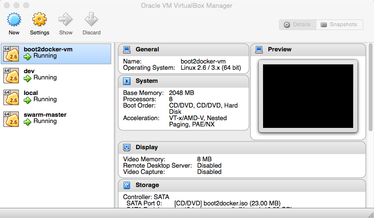
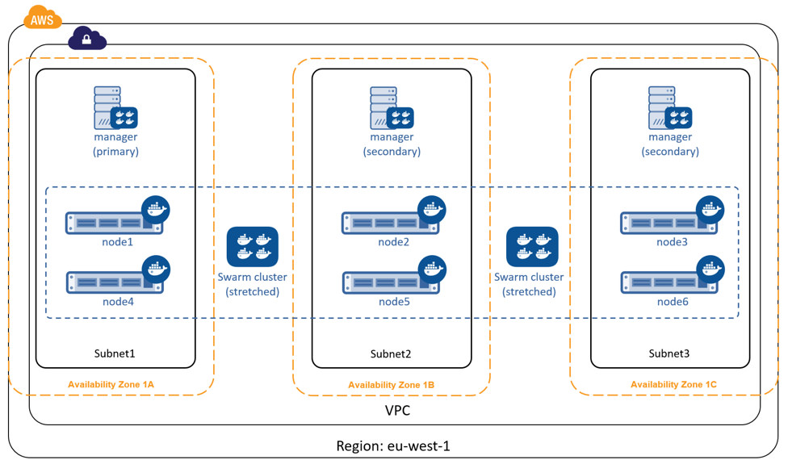
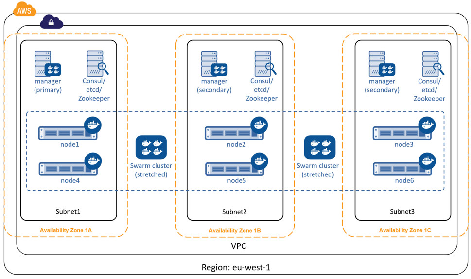

# Docker Swarm
## Docker Swarm 概览

> 您正在查看传统独立Swarm的文档。这些主题描述了独立的Docker Swarm。在Docker 1.12及更高版本中，Swarm模式与Docker引擎集成。大多数用户应该使用集成的swarm模式——一个好的开始方法是使用swarm模式、swarm模式cli命令和docker演练。独立Docker Swarm未集成到Docker引擎API和CLI命令中。

*预计阅读时间：2分钟*

docker swarm是docker的本地集群。它将一个Docker主机池转换为一个虚拟的Docker主机。因为docker swarm提供标准的docker api，任何已经与docker守护进程通信的工具都可以使用swarm透明地扩展到多个主机。支持的工具包括但不限于以下：

* Dokku
* Docker Compose
* Docker Machine
* Jenkins

当然，Docker客户机本身也受到支持。

与其他Docker项目一样，Docker Swarm遵循“交换、即插即用”原则。随着初始开发的结束，API的开发将启用可插拔后端。这意味着您可以用自己喜欢的后端交换Swarm开箱即用的调度后端Docker。Swarm的可交换设计为大多数用例提供了一种流畅的开箱即用的体验，并允许大规模的生产部署来交换更强大的后端，比如介子。

### 了解集群创建

在您的网络上创建一个集群的第一步是拉取Docker Swarm图像。然后，使用Docker，配置Swarm Manager和所有节点来运行Docker Swarm。此方法要求您：

* 打开每个节点上的TCP端口与Swarm Manager通信
* 在每个节点安装Docker
* 创建和管理TLS证书以保护群集

作为一个起点，手动方法最适合有经验的管理员或程序员贡献Docker Swarm。另一种方法是使用` Docker-machine` 安装集群。

使用`Docker Machine`，您可以在云提供商或您自己的数据中心内快速安装Docker群。如果您在本地机器上安装了virtualbox，那么您可以在本地环境中快速构建和探索docker swarm。这个方法自动生成一个证书来保护您的集群。

使用`Docker Machine`，是用户第一次开始使用Swarm的最佳方法。要尝试推荐的入门方法，请参见使用[Docker Swarm入门](https://docs.docker.com/swarm/install-w-machine/)。

如果您对手动安装感兴趣或对贡献感兴趣，请参见[构建用于生产的Swarm集群。](https://docs.docker.com/swarm/install-manual/)

### 发现服务

要动态配置和管理容器中的服务，您可以使用Docker Swarm的Discovery后端。有关哪些后端可用的信息，请参阅[Discovery Service](https://docs.docker.com/swarm/discovery/)文档。

### 高级计划

要了解有关高级计划的更多信息，请参阅[策略](https://docs.docker.com/swarm/scheduler/strategy/)和[筛选](https://docs.docker.com/swarm/scheduler/filter/)文档。

### Swarm API

[Docker Swarm API](https://docs.docker.com/swarm/swarm-api/)与[Docker remote API](https://docs.docker.com/engine/api/)兼容，并通过一些新的端点对其进行扩展。


### 获得帮助

docker swarm仍处于起步阶段，处于积极发展阶段。如果你需要帮助，想要贡献，或者只是想和志同道合的人谈论这个项目，我们有很多开放的沟通渠道。

* 要报告错误或文件功能请求，请使用GitHub上的问题跟踪程序。
* 要与人们实时讨论该项目，请加入IRC上的`#docker swarm`频道。
* 要进行代码或文档更改，请在[GitHub上提交请求](https://github.com/docker/swarm/pulls)。

有关详细信息和资源，请访问[“获取帮助”](https://docs.docker.com/opensource/get-help/)项目页。

## 获得Docker Swarm
> 您正在查看传统独立Swarm的文档。这些主题描述了独立的Docker Swarm。在Docker 1.12及更高版本中，Swarm模式与Docker引擎集成。大多数用户应该使用集成的swarm模式——一个好的开始方法是使用swarm模式、swarm模式cli命令和docker演练。独立Docker Swarm未集成到Docker引擎API和CLI命令中。

预计阅读时间：4分钟

您可以使用容器中的Swarm可执行映像或系统上安装的可执行Swarm二进制文件创建Docker Swarm集群。本页介绍了这两种方法，并讨论了它们的优缺点。

### 使用交互式容器创建集群

您可以使用Docker Swarm官方镜像创建集群。镜像由Docker构建，并通过自动构建定期更新。要使用该镜像，可以通过引擎 `docker run` 命令将其作为容器运行。该镜像有多个选项和子命令，您可以使用它们来创建和管理一个集群。

第一次使用任何镜像时，Docker引擎会检查您的环境中是否已经有镜像。默认情况下，docker运行`swarm:latest`版本，但您也可以指定一个非`latest`的标签。如果您在本地有一个镜像，但Docker Hub上有一个更新的镜像，那么引擎会下载它。

### 从容器中运行集群镜像

1. 在运行引擎的主机上打开终端。

    如果您使用的是Mac或Windows，那么您必须确保启动了运行的Docker引擎主机，并使用Docker机器命令将终端环境指向它。如果您不确定，可以验证：

```shell

 $ docker-machine ls
 NAME      ACTIVE   URL          STATE     URL                         SWARM   DOCKER    ERRORS
 default   *       virtualbox   Running   tcp://192.168.99.100:2376           v1.9.1
 
```

这将显示在`default`实例上运行引擎主机的环境。

2. 用集群镜像执行命令
    最简单的命令是获取镜像的帮助。此命令显示镜像中可用的所有选项。

```shell

 $ docker run swarm --help
 Unable to find image 'swarm:latest' locally
 latest: Pulling from library/swarm
 d681c900c6e3: Pull complete
 188de6f24f3f: Pull complete
 90b2ffb8d338: Pull complete
 237af4efea94: Pull complete
 3b3fc6f62107: Pull complete
 7e6c9135b308: Pull complete
 986340ab62f0: Pull complete
 a9975e2cc0a3: Pull complete
 Digest: sha256:c21fd414b0488637b1f05f13a59b032a3f9da5d818d31da1a4ca98a84c0c781b
 Status: Downloaded newer image for swarm:latest
 Usage: swarm [OPTIONS] COMMAND [arg...]

 A Docker-native clustering system

 Version: 1.0.1 (744e3a3)

 Options:
   --debug                      debug mode [$DEBUG]
   --log-level, -l "info"       Log level (options: debug, info, warn, error, fatal, panic)
   --help, -h                   show help
   --version, -v                        print the version

 Commands:
   create, c    Create a cluster
   list, l      List nodes in a cluster
   manage, m    Manage a docker cluster
   join, j      join a docker cluster
   help, h      Shows a list of commands or help for one command

 Run 'swarm COMMAND --help' for more information on a command.
```

在这个例子中，引擎主机上不存在`Swarm`镜像，所以引擎下载了它。下载之后，镜像执行`help`子命令以显示帮助文本。显示帮助后，`Swarm`镜像退出并返回到终端命令行。

3. 列出主机上正在运行的容器。

```shell
 $ docker ps
 CONTAINER ID        IMAGE               COMMAND             CREATED           STATUS              PORTS               NAMES
```


Swarm不再运行。`Swarm`镜像会在你发出命令后退出。

### 为什么用镜像？

与其他方法相比，使用Swarm容器有三个主要好处：

* 您不需要在系统上安装二进制文件就可以使用镜像。
* 每次运行一个命令`docker run`都会获取并运行镜像的最新版本。
* 容器将蜂群与宿主环境隔离开来。您不需要执行或维护shell路径和环境。

运行`Swarm`镜像是创建和管理集群。Docker的所有文档和教程都使用这个方法

### 运行二进制Swarm

在主机操作系统（OS）上直接运行swarm二进制文件之前，可以从源代码编译二进制文件，或者从其他位置获取可信副本。然后运行swarm二进制。

要从源代码编译Swarm，请参阅[contributing.md](http://github.com/docker/swarm/blob/master/CONTRIBUTING.md)中的说明。

### 为什么要使用二进制？

与其他方法相比，使用swarm二进制文件有一个重要的好处：如果你是一个致力于swarm项目的开发人员，你可以在运行之前测试你的代码更改，而不需要“装箱”二进制文件。

在主机操作系统上运行swarm二进制文件存在以下缺点：

- 从源代码编译是一种负担
- 二进制文件没有Docker容器提供的好处，比如隔离。
- 大多数Docker文档和教程都没有显示这种运行Swarm的方法。


最后，由于Swarm节点不使用引擎，因此不能在节点级别使用基于Docker的软件工具，如Docker Engine CLI。


### 相关信息

- Docker Hub上的[Docker Swarm官方镜像](https://hub.docker.com/_/swarm/)库
- [用Docker机器提供群](https://docs.docker.com/swarm/provision-with-machine/)

## 安装并创建Docker集群

>您正在查看传统独立Swarm的文档。这些主题描述了独立的Docker Swarm。在Docker 1.12及更高版本中，[Swarm模式](https://docs.docker.com/engine/swarm/)与Docker引擎集成。大多数用户应该使用集成的swarm模式——一个好的开始方法是[使用swarm模式](https://docs.docker.com/engine/swarm/swarm-tutorial/)、[swarm模式cli命令](https://docs.docker.com/engine/swarm/#swarm-mode-cli-commands)和[docker演练](https://docs.docker.com/get-started/)。独立Docker Swarm未集成到Docker引擎API和CLI命令中。

预计阅读时间：8分钟


您可以使用Docker Swarm来托管和调度一组Docker容器。本节通过教您如何使用Docker机器和virtualbox在本地机器上创建一个Swarm，向您介绍Docker Swarm。

### 先决条件

确保本地系统已安装VirtualBox。如果您使用的是MacOS或Windows并安装了Docker，则应该已经安装了VirtualBox。使用适合您的系统架构的说明，[安装Docker机器](https://docs.docker.com/machine/install-machine)。

### 创建一个Docker Swarm

Docker机器让主机准备好运行Docker容器。Docker群中的每个节点都必须能够访问Docker来提取镜像并在容器中运行它们。Docker机器为您的Swarm管理所有这些供应。

在用`docker-machine`创建一个集群之前，您将每个节点与一个发现服务相关联。此示例使用Docker Hub托管的令牌发现服务（仅用于测试/dev，不用于生产）。这个发现服务将一个令牌与每个节点上运行的Docker守护进程的实例相关联。其他发现服务后端，如`etcd`、`consul`和`zooKeeper` 是可用的。

1. 列出系统上的机器。
```shell
$ docker-machine ls
NAME         ACTIVE   DRIVER       STATE     URL                         SWARM
docker-vm    *        virtualbox   Running   tcp://192.168.99.100:2376
```
这个例子是在安装了Docker工具箱的MacOS系统上运行的。所以，`ocker-vm`拟机在列表中。

2. 在系统上创建名为本地的虚拟机。
```shell
$ docker-machine create -d virtualbox local
INFO[0000] Creating SSH key...
INFO[0000] Creating VirtualBox VM...
INFO[0005] Starting VirtualBox VM...
INFO[0005] Waiting for VM to start...
INFO[0050] "local" has been created and is now the active machine.
        INFO[0050] To point your Docker client at it, run this in your shell: eval "$(docker-machine env local)"
```
3. 将本地机器配置加载到shell中。
```shell.
$ eval "$(docker-machine env local)"
```
4. 使用Docker Swarm镜像生成发现令牌。

下面的命令在容器中运行`swarm create`命令。如果你还没有收到`swarm:latest`你本地机器上的最新镜像，Docker会帮你拉过来。

```shell

$ docker run swarm create
Unable to find image 'swarm:latest' locally
latest: Pulling from swarm
de939d6ed512: Pull complete
79195899a8a4: Pull complete
79ad4f2cc8e0: Pull complete
0db1696be81b: Pull complete
ae3b6728155e: Pull complete
57ec2f5f3e06: Pull complete
73504b2882a3: Already exists
swarm:latest: The image you are pulling has been verified. Important: image verification is a tech preview feature and should not be relied on to provide security.
Digest: sha256:aaaf6c18b8be01a75099cc554b4fb372b8ec677ae81764dcdf85470279a61d6f
Status: Downloaded newer image for swarm:latest
fe0cc96a72cf04dba8c1c4aa79536ec3
```

`swarm create`命令返回`fe0cc96a72cf04dba8c1c4aa79536ec3`令牌。注意：这个命令依赖于Docker Swarm的托管发现服务。如果此服务有问题，此命令可能会失败。在本例中，请参阅有关使用其他类型的[发现后端](https://docs.docker.com/swarm/discovery/)的信息。检查[状态页](http://status.docker.com/)以了解服务可用性。

1. 把令牌保存在安全的地方。
   
    在下一步中，您将使用此令牌创建Docker群。
    
### 启动集群管理器

网络中的一个系统称为Docker Swarm Manager。Swarm Manager在整个集群上协调和调度容器。Swarm Manager规则一组代理（也称为节点或Docker节点）。

Swarm代理负责托管容器。它们是常规的Docker守护进程，您可以使用Docker引擎API与它们通信。

在本节中，您将创建一个Swarm Manager和两个节点。

1. 在virtualbox下创建一个Swarm Manager。
```shell
docker-machine create \
        -d virtualbox \
        --swarm \
        --swarm-master \
        --swarm-discovery token://<TOKEN-FROM-ABOVE> \
        swarm-master
```

例如:
```shell
$ docker-machine create -d virtualbox --swarm --swarm-master --swarm-discovery token://fe0cc96a72cf04dba8c1c4aa79536ec3 swarm-master
INFO[0000] Creating SSH key...
INFO[0000] Creating VirtualBox VM...
INFO[0005] Starting VirtualBox VM...
INFO[0005] Waiting for VM to start...
INFO[0060] "swarm-master" has been created and is now the active machine.
INFO[0060] To point your Docker client at it, run this in your shell: eval "$(docker-machine env swarm-master)"
```
2. 打开你的virtualbox管理器，它应该包含`本地`机器和新的`swarm-master`。



3. 创建一个集群节点
```shell
docker-machine create \
-d virtualbox \
--swarm \
--swarm-discovery token://<TOKEN-FROM-ABOVE> \
swarm-agent-00
```
例如:

```shell
$ docker-machine create -d virtualbox --swarm --swarm-discovery token://fe0cc96a72cf04dba8c1c4aa79536ec3 swarm-agent-00
INFO[0000] Creating SSH key...
INFO[0000] Creating VirtualBox VM...
INFO[0005] Starting VirtualBox VM...
INFO[0006] Waiting for VM to start...
INFO[0066] "swarm-agent-00" has been created and is now the active machine.
INFO[0066] To point your Docker client at it, run this in your shell: eval "$(docker-machine env swarm-agent-00)"
```
4. 添加另一个名为`swarm-agent-01`的代理。
```shell
 docker-machine create -d virtualbox --swarm --swarm-discovery token://fe0cc96a72cf04dba8c1c4aa79536ec3 swarm-agent-01
```

您应该在VirtualBox管理器中看到这两个代理。

### 引导你的集群

在这一步中，您连接到Swarm 机器，显示与您的Swarm相关的信息，并在您的Swarm上启动镜像。

1. 将您的Docker环境指向运行Swarm Master的机器。
```shell
$ eval $(docker-machine env --swarm swarm-master)
```
2. 使用`docker`命令获取有关新群的信息。
```shell
$ docker info
Containers: 4
Strategy: spread
Filters: affinity, health, constraint, port, dependency
Nodes: 3
 swarm-agent-00: 192.168.99.105:2376
    └ Containers: 1
    └ Reserved CPUs: 0 / 8
    └ Reserved Memory: 0 B / 1.023 GiB
 swarm-agent-01: 192.168.99.106:2376
    └ Containers: 1
    └ Reserved CPUs: 0 / 8
    └ Reserved Memory: 0 B / 1.023 GiB
 swarm-master: 192.168.99.104:2376
    └ Containers: 2
    └ Reserved CPUs: 0 / 8
```


您可以看到每个代理和主机都暴露了端口`2376`。当你创建一个群时，你可以使用你喜欢的任何端口，甚至在不同的节点上使用不同的端口。每个群节点运行群代理容器。(译者注：但是，好像这个文档有点老，现在是2377？)

master同时运行swarm管理器和swarm代理容器。在生产环境中不建议这样做，因为这会导致代理故障转移出现问题。然而，在这样一个学习环境中这样做是非常好的。

3. 检查群中当前运行的镜像。
```shell
$ docker ps  -a
CONTAINER ID        IMAGE               COMMAND                CREATED             STATUS              PORTS                                     NAMES
78be991b58d1        swarm:latest        "/swarm join --addr    3 minutes ago       Up 2 minutes        2375/tcp                                  swarm-agent-01/swarm-agent
da5127e4f0f9        swarm:latest        "/swarm join --addr    6 minutes ago       Up 6 minutes        2375/tcp                                  swarm-agent-00/swarm-agent
ef395f316c59        swarm:latest        "/swarm join --addr    16 minutes ago      Up 16 minutes       2375/tcp                                  swarm-master/swarm-agent
45821ca5208e        swarm:latest        "/swarm manage --tls   16 minutes ago      Up 16 minutes       2375/tcp, 192.168.99.104:3376->3376/tcp   swarm-master/swarm-agent-master
```
4. 在你的集群上运行Docker `Hello World` 测试镜像
```shell
$ docker run hello-world
Hello from Docker.
This message shows that your installation appears to be working correctly.

To generate this message, Docker took the following steps:
 1. The Docker client contacted the Docker daemon.
 2. The Docker daemon pulled the "hello-world" image from the Docker Hub.
        (Assuming it was not already locally available.)
 3. The Docker daemon created a new container from that image which runs the
        executable that produces the output you are currently reading.
 4. The Docker daemon streamed that output to the Docker client, which sent it
        to your terminal.
```

要尝试更具野心的东西，您可以运行一个Ubuntu容器：

```shell
> $ docker run -it ubuntu bash
```

有关更多示例和想法，请访问[用户指南](https://docs.docker.com/engine/userguide/)。

5. 使用`docker ps`命令找出容器运行在哪个节点上。
```shell
$ docker ps -a
CONTAINER ID        IMAGE                COMMAND                CREATED             STATUS                     PORTS                                     NAMES
54a8690043dd        hello-world:latest   "/hello"               22 seconds ago      Exited (0) 3 seconds ago                                             swarm-agent-00/modest_goodall
78be991b58d1        swarm:latest         "/swarm join --addr    5 minutes ago       Up 4 minutes               2375/tcp                                  swarm-agent-01/swarm-agent
da5127e4f0f9        swarm:latest         "/swarm join --addr    8 minutes ago       Up 8 minutes               2375/tcp                                  swarm-agent-00/swarm-agent
ef395f316c59        swarm:latest         "/swarm join --addr    18 minutes ago      Up 18 minutes              2375/tcp                                  swarm-master/swarm-agent
45821ca5208e        swarm:latest         "/swarm manage --tls   18 minutes ago      Up 18 minutes              2375/tcp, 192.168.99.104:3376->3376/tcp   swarm-master/swarm-agent-master
```
### 下一步

此时，您已经通过从Docker Hub中提取它的最新图像安装了Docker Swarm。然后，您使用virtualbox在本地机器上构建并运行了一个集群。如果您愿意，可以阅读[Docker Swarm功能概述](https://docs.docker.com/swarm/)。或者，您可以通过在网络上[手动安装Swarm](https://docs.docker.com/swarm/install-manual/)来开发更深入的Swarm视图。

## 集群生产计划
> 在查看传统独立Swarm的文档。这些主题描述了独立的Docker Swarm。在Docker 1.12及更高版本中，[Swarm模式](https://docs.docker.com/engine/swarm/)与Docker引擎集成。大多数用户应该使用集成的swarm模式——一个好的开始方法是[使用swarm模式](https://docs.docker.com/engine/swarm/swarm-tutorial/)、[swarm模式cli命令](https://docs.docker.com/engine/swarm/#swarm-mode-cli-commands)和[docker演练](https://docs.docker.com/get-started/)。独立Docker Swarm未集成到Docker引擎API和CLI命令中。

预计阅读时间：14分钟

本文提供了一些指导，帮助您规划、部署和管理关键业务生产环境中的Docker Swarm集群。包括以下高级主题：

* [安全](https://docs.docker.com/swarm/plan-for-production/#security)
* [高可用性](https://docs.docker.com/swarm/plan-for-production/#high-availability)
* [性能](https://docs.docker.com/swarm/plan-for-production/#performance)
* [集群所有权](https://docs.docker.com/swarm/plan-for-production/#cluster-ownership)

### 安全

要确保docker swarm集群的安全，有许多方面。本节包括：

- 使用TLS进行身份验证
- 网络访问控制


这些主题并不详尽。它们构成了更广泛的安全体系结构的一部分，包括：安全修补、强大的密码策略、基于角色的访问控制、诸如`SELinux`和`Apparmor`等技术、严格的审计等等。

### 集群的TLS配置 

集群中的所有节点必须将其Docker引擎守护进程绑定到网络端口。这带来了所有与网络相关的常见安全隐患，如中间人攻击。当所讨论的网络不受信任时（如Internet），这些风险就更加复杂了。为了降低这些风险，Swarm和引擎支持传输层安全（TLS）进行身份验证。

配置为使用tls的引擎守护进程（包括swarm manager）只接受来自Docker引擎客户机的签署通信的命令。Engine和Swarm支持外部第三方证书颁发机构（CA）以及内部公司CA。

TLS的默认引擎和swarm端口为：

* 引擎守护进程：2376/TCP(译者注：译者值看到2377)
* 集群管理器：3376/TCP(译者注：没看到这个端口)

有关配置Swarm for TLS的更多信息，请[参阅概述Docker Swarm with TLS](https://docs.docker.com/swarm/secure-swarm-tls/)页面。

### 网络访问控制

生产网络很复杂，通常会被锁定，以便只有允许的流量才能在网络上流动。下面的列表显示了swam集群的不同组件侦听的网络端口和协议。您应该使用这些配置防火墙和其他网络访问控制列表。

* Swarm manager/集群管理器：
    - `入站 80/tcp(HTTP)` 这允许 `docker pull`命令工作。如果您计划从Docker Hub中提取镜像，则必须允许通过端口80进行Internet连接。
    - `入站 2375/tcp` 这允许docker engine cli命令直接指向引擎守护进程。
    - `入站 3375/tcp` 这允许引擎向Swarm Manager发出CLI命令。
    - ` 入站 22/tcp` 这允许通过ssh进行远程管理。
* Service Discovery/服务发现：
    * `入站 80/tcp(HTTP)` 这允许 `docker pull` 命令工作。如果您计划从Docker Hub中提取镜像，则必须允许通过端口80进行Internet连接。
    * `入站发现服务端口`这需要设置后端发现服务监听的端口（Consul、ETCD或ZooKeeper）。
    * `入站 22/tcp` 这允许通过ssh进行远程管理。
* Swarm nodes/集群节点：
    * `入站 80/tcp(HTTP)` 这允许 `docker pull` 命令工作。如果您计划从Docker Hub中提取镜像，则必须允许通过端口80进行Internet连接。
    * `入站 2375/tcp` 这允许docker engine cli命令直接指向引擎守护进程。
    * `入站 22/tcp` 这允许通过ssh进行远程管理。
* 自定义跨主机容器网络：
    * `入站 7946/tcp` 允许发现其他容器网络。
    * `入站 7946/udp` 允许发现其他容器网络。
    * `入站 <store-port>/tcp` 网络密钥值存储服务端口。
    * `4789/udp`对于容器覆盖网络。
    * `ESP包`对于加密的覆盖网络。


如果防火墙和其他网络设备具有连接状态意识，则它们允许对已建立的TCP连接作出响应。如果您的设备不知道状态，则需要从32768-65535打开临时端口。为了增加安全性，您可以将临时端口规则配置为仅允许来自已知Swarm设备上接口的连接。

如果您的Swarm集群配置为TLS，则将`2375`替换为`2376`，将`3375`替换为`3376`。

上面列出的端口仅用于群集操作，如群集创建、群集管理和针对群集的容器调度。您可能需要为与应用程序相关的通信打开其他网络端口。

群簇的不同组成部分可能存在于不同的网络上。例如，许多组织运行单独的管理和生产网络。一些Docker引擎客户端可能存在于管理网络上，而Swarm管理器、发现服务实例和节点可能存在于一个或多个生产网络上。为了抵消网络故障，您可以跨多个生产网络部署Swarm管理器、发现服务和节点。在所有这些情况下，您可以使用上面的端口列表来帮助网络基础结构团队高效、安全地配置网络。

### 高可能性(HA)

所有的生产环境都应该是高度可用的，这意味着它们在很长一段时间内都在持续运行。为了实现高可用性，环境必须能够承受其单个组件部件的故障。

以下部分将讨论一些技术和最佳实践，这些技术和最佳实践使您能够构建具有弹性的、高度可用的Swarm集群。然后，您可以使用这些集群运行最苛刻的生产应用程序和工作负载。

#### Swarm管理器HA

Swarm Manager负责接受进入群集的所有命令，并针对群集调度资源。如果Swarm Manager不可用，则在Swarm Manager再次可用之前，无法执行某些群集操作。在大型业务关键场景中，这是不可接受的。

Swarm提供了HA功能，以减轻Swarm Manager可能出现的故障。您可以使用Swarm的HA功能为单个集群配置 多个Swarm管理器。这些群管理器以主动/被动的形式运行，其中一个群管理器是主要的，所有其他的都是次要的。

Swarm二级管理器作为热备盘运行，这意味着它们在主Swarm管理器的背景下运行。第二个群管理器是在线的，接受发送给集群的命令，就像第一个群管理器一样。但是，二元程序接收到的任何命令都会转发到执行它们的主程序。如果主要的Swarm管理器失败，将从幸存的二级系统中选出新的主要系统。

在创建HA Swarm管理器时，您应该注意尽可能多地将它们分布在故障域中。故障域是一个网络部分，如果关键设备或服务遇到问题，它可能会受到负面影响。例如，如果您的集群运行在Amazon Web Services（EU-WEST-1）的爱尔兰地区，并且您配置了三个Swarm管理器（1个主管理器，2个辅助管理器），那么您应该在每个可用性区域中放置一个，如下所示。



在这种配置中，集群可以在任何两个可用性区域的损失中生存下来。为了使您的应用程序能够在这样的故障中生存下来，它们也必须跨许多故障域进行架构设计


对于服务于高需求、业务线应用程序的Swarm集群，您应该有3个或更多的Swarm管理器。此配置允许您关闭一个管理器进行维护，遇到意外故障，并继续管理和操作集群。

#### 发现服务（HA）

发现服务是集群的关键组成部分。如果发现服务不可用，这可能会阻止某些群集操作。例如，如果没有工作的发现服务，诸如向集群添加新节点和对集群配置进行查询等操作将失败。这在业务关键型生产环境中是不可接受的。

Swarm支持四种后端发现服务：

* 托管（不用于生产）
* Consul
* ETCD
* Zookeeper

Consul、ETCD和ZooKeeper均适用于生产，应配置为高可用性。您应该使用每个服务的现有工具和最佳实践来为HA配置这些工具和最佳实践。

对于服务于高需求、业务线应用程序的Swarm集群，建议拥有5个或更多发现服务实例。这是因为他们使用的复制/HA技术（如paxos/raft）需要很强的仲裁。有5个实例可以让您取下一个实例进行维护，遇到意外的故障，并且仍然保持很强的法定人数。

在创建一个高度可用的Swarm发现服务时，您应该注意将每个发现服务实例分布在尽可能多的失败域上。例如，如果您的集群运行在Amazon Web Services（EU-WEST-1）的爱尔兰区域，并且您配置了三个发现服务实例，那么应该在每个可用性区域中放置一个实例。

下图显示了为HA配置的集群。它有三个Swarm管理器和三个遍布三个故障域（可用性区域）的发现服务实例。它还具有在所有三个失效域中平衡的群节点。以下所示配置中两个可用性区域的丢失不会导致集群下降。


可以在群发现和引擎容器网络之间共享相同的Consul、ETCD或ZooKeeper容器。但是，为了获得最佳性能和可用性，您应该部署专用的实例——一个用于Swarm的发现实例，另一个用于您的容器网络。

#### 多重云

您可以构建和构建跨越多个云提供商的集群，甚至跨越公共云和内部基础设施。下图显示了一个横跨AWS和Azure的集群示例。


虽然这样的体系结构似乎可以提供最终的可用性，但是有几个因素需要考虑。网络延迟可能有问题，分区也可能有问题。因此，您应该认真考虑向这些云平台提供可靠、高速、低延迟连接的技术，如AWS Direct Connect和Azure ExpressRoute。

如果您正在考虑跨多个这样的基础结构进行生产部署，请确保在整个系统上具有良好的测试覆盖率。

#### 孤立的生产环境

可以在单个集群上运行多个环境，如开发、分段和生产。通过标记群节点并使用约束将容器过滤到标记为生产或分段等的节点上，可以实现这一点。但是，不建议这样做。建议采用气隙生产环境，尤其是高性能关键业务生产环境。

例如，许多公司不仅为生产部署专用的独立基础设施，例如网络、存储、计算和其他系统。它们还部署单独的管理系统和策略。这会导致用户拥有独立的登录生产系统的账户等情况。在这些类型的环境中，必须部署专用的生产集群，在生产硬件基础设施上运行，并遵循全面的生产管理、监控、审计和其他政策。

#### 操作系统选择

您应该仔细考虑您的Swarm基础设施所依赖的操作系统。这种考虑对于生产环境至关重要。

一个公司在开发环境中使用一个操作系统，在生产环境中使用另一个操作系统并不罕见。一个常见的例子是在开发环境中使用CentOS，然后在生产环境中使用Red Hat Enterprise Linux（RHEL）。这个决定通常是成本和支持之间的平衡。CentosLinux可以免费下载和使用，但商业支持选项很少，而且还远远不够。然而，RHEL有一个相关的支持和许可成本，但有来自RedHat的世界级商业支持。

在选择要与您的集群一起使用的生产操作系统时，请选择一个与您在开发和登台环境中使用的操作系统非常匹配的操作系统。尽管容器抽象了许多底层操作系统，但有些特性具有配置要求。例如，要与Docker Engine 1.10或更高版本一起使用Docker容器网络，您的主机必须具有3.10或更高版本的Linux内核。参考变更日志了解特定版本的Docker Engine或Swarm的要求。

您还应该考虑部署和可能修补生产操作系统的过程和渠道。

### 性能

在支持关键业务线应用程序的环境中，性能至关重要。以下各节将讨论一些可以帮助您构建高性能集群的技术和最佳实践。

#### 容器网络
Docker引擎容器网络是覆盖网络，可以跨多个引擎主机创建。因此，容器网络需要一个键值（kv）存储来维护网络配置和状态。这个kv存储可以与swarm集群发现服务使用的存储共享。但是，为了获得最佳性能和故障隔离，您应该为容器网络和群发现部署单独的Kv存储实例。这在要求严格的业务关键型生产环境中尤其如此。

从Docker Engine1.9开始，Docker容器网络需要特定的Linux内核版本。更高的内核版本通常是首选的，但是由于内核的新颖性，不稳定的风险会增加。在可能的情况下，使用已经被批准在生产环境中使用的内核版本。如果不能在生产中使用3.10或更高版本的Linux内核，则应尽早开始审批较新内核的过程。

#### 调度策略
调度策略是Swarm如何决定集群中要启动容器的节点。Swarm支持以下策略：

* 传播
* 二进制包
* 随机（不用于生产）

你也可以自己写。

**传播**是默认策略。它尝试在集群中的所有节点上均匀地平衡容器的数量。对于高性能集群来说，这是一个不错的选择，因为它将容器工作负载分布在集群中的所有资源上。这些资源包括CPU、RAM、存储和网络带宽。

如果您的群节点在多个故障域中保持平衡，则扩展策略会均匀地在这些故障域中平衡容器。但是，spread本身并不知道这些容器中的任何一个的角色，因此没有智能来跨故障域传播同一服务的多个实例。要实现这一点，您应该使用标记和约束。

在调度下一个节点上的容器之前，**binpack**策略在一个节点上运行尽可能多的容器，从而有效地填充它。

这意味着在集群填满之前，binpack不会使用所有集群资源。因此，在运行binpack策略的swarm集群上运行的应用程序可能不如运行spread策略的应用程序。然而，binpack是一个最小化基础设施需求和成本的好选择。例如，假设您有一个10节点的集群，其中每个节点有16个CPU和128GB的RAM。但是，整个集群中的容器工作负载只使用相当于6个CPU和64GB RAM的内存。扩展策略将在集群中的所有节点上平衡容器。但是，binpack策略将所有容器放在一个节点上，这可能允许您关闭其他节点并节省成本。

### Swarm集群的所有权

所有权问题在生产环境中至关重要。因此，在计划、记录和部署生产集群时，考虑并同意以下所有内容至关重要。

* 生产集群基础设施的预算来自谁？
* 谁拥有能够管理和管理生产集群的账户？
* 谁负责监控生产群基础设施？
* 谁负责修补和升级生产群基础设施？
* 随叫随到的责任和升级程序？

以上并不是一个完整的列表，问题的答案因组织和团队的结构而异。一些公司沿着**DevOps**路线前进，而其他公司则没有。无论您的公司处于何种情况下，您都必须将上述所有因素考虑到生产集群的规划、部署和持续管理中。

### 相关信息

* 尝试大规模集群
* Swarm和容器网络
* 高可用性在Docker Swarm
* Docker数据中心

## 构建生产集群

> 您正在查看传统独立Swarm的文档。这些主题描述了独立的Docker Swarm。在Docker 1.12及更高版本中，Swarm模式与Docker引擎集成。大多数用户应该使用集成的swarm模式——一个好的开始方法是使用swarm模式、swarm模式cli命令和docker演练。独立Docker Swarm未集成到Docker引擎API和CLI命令中。

预计阅读时间：10分钟

本页教您如何部署高可用性Swarm集群。尽管示例安装使用AmazonWebServices（AWS）平台，但您可以在许多其他平台上部署等效的Swarm。在本例中，您执行以下操作：

* 验证您是否具备先决条件
* 建立基本的网络安全
* 创建节点
* 在每个节点上安装引擎
* 配置发现后端
* 创建Swarm集群
* 与Swarm通信
* 测试高可用性Swarm管理器
* 其他资源

对于Docker Swarm的快速启动，[请尝试在沙盒](https://docs.docker.com/swarm/install-w-machine/)页面中评估Swarm。

### 先决条件


* 亚马逊网络服务（AWS）帐户
* 熟悉AWS功能和工具，如：
    * 弹性云（EC2）的仪表板
    * 虚拟私有云（VPC）仪表盘
    * vpc安全组
    * 使用ssh连接到ec2实例

### 步骤1。添加网络安全规则
### 步骤2。创建实例
### 步骤3。在每个节点上安装引擎
### 步骤4。设置发现后端
### 步骤5。创建Swarm集群
### 步骤6。与Swarm通信
### 步骤7。测试群故障转移
### 其他资源